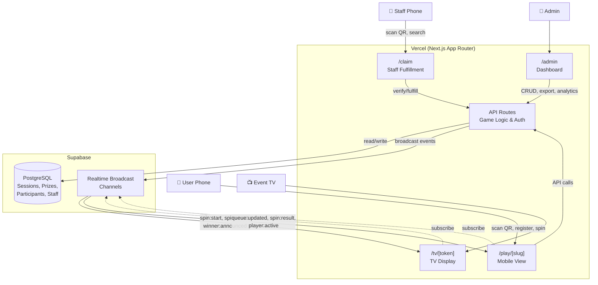

# Spin and Win — Technical Requirements & Architecture

## 1. Tech Stack

| Layer | Technology | Rationale |
|-------|-----------|-----------|
| Framework | Next.js 14+ (App Router) | Native Vercel deployment, API routes, SSR/SSG |
| Language | TypeScript | Type safety across full stack |
| Database | Supabase PostgreSQL | Free tier 500MB, relational, managed |
| Real-time | Supabase Realtime Broadcast | 200 free concurrent connections, 100 msg/sec |
| Styling | Tailwind CSS | Utility-first, tree-shakes to minimal CSS |
| Wheel Animation | react-custom-roulette | `prizeNumber` prop for server-dictated outcome |
| QR Generation | qrcode.react | SVG-based, lightweight |
| QR Scanning | html5-qrcode | Camera-based scanner, works on mobile browsers |
| Confetti | canvas-confetti | ~6KB vanilla JS, no framework dependency |
| Deployment | Vercel | Serverless, edge-ready, auto-scaling |
| Auth | Custom JWT (httpOnly cookies) | Lightweight, no external auth provider needed |

---

## 2. Database Schema

### 2.1 Tables

#### sessions

| Column | Type | Constraints |
|--------|------|-------------|
| id | uuid | PK, default gen_random_uuid() |
| event_name | text | NOT NULL |
| slug | text | UNIQUE, NOT NULL |
| start_time | timestamptz | NOT NULL |
| end_time | timestamptz | NOT NULL |
| max_spins_per_user | int | NOT NULL, default 1 |
| include_no_prize | boolean | NOT NULL, default false |
| theme | text | NOT NULL, CHECK IN ('corporate', 'party', 'holiday') |
| sound_preset | text | NOT NULL, CHECK IN ('drumroll', 'gameshow', 'casino') |
| tv_token | text | UNIQUE, NOT NULL |
| status | text | NOT NULL, CHECK IN ('draft', 'active', 'ending', 'ended'), default 'draft' |
| created_at | timestamptz | NOT NULL, default now() |
| updated_at | timestamptz | NOT NULL, default now() |

#### prizes

| Column | Type | Constraints |
|--------|------|-------------|
| id | uuid | PK, default gen_random_uuid() |
| session_id | uuid | FK → sessions(id) ON DELETE CASCADE, NOT NULL |
| name | text | NOT NULL |
| weight | int | NOT NULL, CHECK > 0 |
| inventory_count | int | NOT NULL, CHECK >= 0 |
| is_no_prize | boolean | NOT NULL, default false |

#### participants

| Column | Type | Constraints |
|--------|------|-------------|
| id | uuid | PK, default gen_random_uuid() |
| session_id | uuid | FK → sessions(id) ON DELETE CASCADE, NOT NULL |
| name | text | NOT NULL |
| phone | text | NOT NULL |
| status | text | NOT NULL, CHECK IN ('queued', 'active', 'spinning', 'completed'), default 'queued' |
| queue_position | int | NOT NULL |
| prize_id | uuid | FK → prizes(id), NULLABLE |
| result_token | text | UNIQUE, NULLABLE |
| spins_used | int | NOT NULL, default 0 |
| is_fulfilled | boolean | NOT NULL, default false |
| fulfilled_by | uuid | FK → staff(id), NULLABLE |
| fulfilled_at | timestamptz | NULLABLE |
| spin_started_at | timestamptz | NULLABLE |
| spin_completed_at | timestamptz | NULLABLE |
| joined_at | timestamptz | NOT NULL, default now() |

#### staff

| Column | Type | Constraints |
|--------|------|-------------|
| id | uuid | PK, default gen_random_uuid() |
| session_id | uuid | FK → sessions(id) ON DELETE CASCADE, NOT NULL |
| name | text | NOT NULL |
| invite_code | text | UNIQUE, NOT NULL |
| device_registered | boolean | NOT NULL, default false |
| registered_at | timestamptz | NULLABLE |

#### admins

| Column | Type | Constraints |
|--------|------|-------------|
| id | uuid | PK, default gen_random_uuid() |
| username | text | UNIQUE, NOT NULL |
| password_hash | text | NOT NULL |

### 2.2 Indexes

| Index | Table | Columns | Type |
|-------|-------|---------|------|
| idx_participants_session_phone | participants | (session_id, phone) | UNIQUE |
| idx_sessions_slug | sessions | (slug) | UNIQUE |
| idx_sessions_tv_token | sessions | (tv_token) | UNIQUE |
| idx_participants_result_token | participants | (result_token) | UNIQUE (where not null) |
| idx_staff_invite_code | staff | (invite_code) | UNIQUE |
| idx_participants_session_status | participants | (session_id, status) | BTREE |
| idx_participants_session_queue | participants | (session_id, queue_position) | BTREE |
| idx_prizes_session | prizes | (session_id) | BTREE |

### 2.3 Relationships

```
sessions 1──* prizes
sessions 1──* participants
sessions 1──* staff
prizes   1──* participants (via prize_id)
staff    1──* participants (via fulfilled_by)
```

---

## 3. Route Structure

```
app/
├── tv/[token]/            → TV display (fullscreen, token-protected)
├── play/[slug]/           → Mobile user flow (register → queue → spin → result)
├── admin/                 → Admin login + dashboard
│   ├── sessions/          → Create/edit events
│   ├── reports/           → Live view + export
│   └── staff/             → Generate invite codes
├── claim/                 → Staff/Admin fulfillment (invite code OR admin session)
└── api/
    ├── auth/
    │   ├── login/         → POST: Admin login → JWT
    │   └── staff/         → POST: Staff invite code registration
    ├── sessions/
    │   ├── route.ts       → GET (list), POST (create)
    │   └── [id]/
    │       ├── route.ts   → GET, PUT (edit), PATCH (status change)
    │       └── end/       → POST: Manual end event
    ├── spin/
    │   └── route.ts       → POST: Trigger spin (validate + calculate + broadcast)
    ├── queue/
    │   ├── join/          → POST: Register and join queue
    │   └── status/        → GET: Get position by phone (session recovery)
    ├── claim/
    │   ├── verify/[token] → GET: Look up participant by result token
    │   ├── fulfill/       → POST: Mark as fulfilled
    │   └── search/        → GET: Search by name/phone
    ├── staff/
    │   └── generate/      → POST: Generate invite code(s)
    └── export/
        └── [sessionId]/   → GET: CSV download
```

---

## 4. Real-time Channel Design

```
Channel: session:{session_id}

Events:
├── queue:updated        → Payload: { positions: [{id, position}] }
│                          Listeners: All queued phones
│                          Trigger: User joins, user completes, user leaves
│
├── player:active        → Payload: { participant_id, name, position }
│                          Listeners: TV, promoted user's phone
│                          Trigger: Previous player completes spin
│
├── spin:start           → Payload: { participant_id, name }
│                          Listeners: TV
│                          Trigger: User taps "SPIN" button on phone
│
├── spin:result          → Payload: { participant_id, name, prize_name, prize_index, is_no_prize }
│                          Listeners: TV (animate to prize_index), active phone (show result)
│                          Trigger: Server calculates prize after spin:start
│
├── winner:announced     → Payload: { name, prize_name, timestamp }
│                          Listeners: TV (update leaderboard)
│                          Trigger: After spin:result for non-no-prize outcomes
│
├── session:ended        → Payload: { reason: 'manual' | 'time_expired' | 'queue_drained' }
│                          Listeners: All connected clients
│                          Trigger: Admin ends event or queue drains after soft stop
```

---

## 5. Architecture Diagram



---

## 6. Core Algorithms

### 6.1 Weighted Prize Selection

```
Input:  List of prizes for the session where inventory_count > 0
Output: Selected prize ID and wheel slice index

Algorithm:
1. Filter prizes to those with inventory_count > 0.
2. If no prizes available and include_no_prize is false → return error (notify admin).
3. If include_no_prize is true, include the "no prize" entry in the pool.
4. Calculate total_weight = sum of all eligible prize weights.
5. Generate random number R in range [0, total_weight).
6. Iterate through prizes, accumulating weight. Select prize where cumulative weight > R.
7. Atomically decrement inventory_count for the selected prize (use DB transaction).
8. If decrement fails (race condition, inventory hit 0), retry from step 1.
9. Return prize_id and the slice index (position in the original prize list for the wheel).

Edge Cases:
- All prizes depleted: If include_no_prize is true, always land on "no prize."
  If include_no_prize is false, return error and notify admin via dashboard.
- Concurrent spins: Not possible (one active player at a time), but atomic decrement protects against edge cases.
```

### 6.2 Queue Management

```
FIFO Queue per Session:

On Registration (POST /api/queue/join):
1. Validate session is 'active' and current time < end_time.
2. Check phone uniqueness within session.
3. Check spins_used < max_spins_per_user.
4. Assign queue_position = MAX(queue_position) + 1 for the session.
5. If no other participant has status 'active' or 'spinning', promote this user immediately.
6. Otherwise, insert with status 'queued'.
7. Broadcast queue:updated to all queued participants.

On Spin Complete:
1. Set current player status → 'completed'.
2. Query next participant with status 'queued' ORDER BY queue_position ASC LIMIT 1.
3. If found: set status → 'active', broadcast player:active.
4. If not found and session status is 'ending': transition session to 'ended'.
5. Broadcast queue:updated to remaining queued participants.

On Session End (manual):
1. Set session status → 'ended'.
2. Set all 'queued' participants status → 'completed' (they did not play).
3. Broadcast session:ended to all connected clients.
```

---

## 7. Authentication & Authorization

| Role | Access | Auth Method |
|------|--------|-------------|
| Admin | All routes and all features | Username/password → JWT in httpOnly cookie |
| Staff | /claim only (scan + search + fulfill) | One-time invite code → session cookie |
| User | /play/[slug] only | No auth — identified by phone number within session |
| TV | /tv/[token] only | Token embedded in URL (generated per session) |

- Admin has a superset of staff permissions and can access /claim without an invite code.
- JWT tokens expire after 24 hours; refresh is not needed for event-length sessions.
- Staff session cookies are scoped to the event session and expire when the session ends.

---

## 8. Security Considerations

- Prize determination is strictly server-side. The client has no influence on the outcome.
- TV tokens are cryptographically random (UUID v4) and unique per session.
- Result tokens (for prize QR codes) are cryptographically random (UUID v4).
- Phone numbers are validated (format check) and deduplicated per session.
- Staff invite codes are single-use and invalidated after device registration.
- Admin passwords are hashed with bcrypt (cost factor 12+).
- All API routes validate session status before accepting actions.
- Rate limiting applied to registration and spin endpoints (prevent abuse).
- No sensitive data exposed in client-side JavaScript bundles.
- HTTPS enforced (Vercel default).

---

## 9. Network Resilience

- **Server is the source of truth** for all game state. Clients are display-only.
- **Phone disconnect during spin:** If POST /api/spin was received server-side, the TV animates regardless. When the phone reconnects, it re-subscribes and fetches current state via GET /api/queue/status using the phone number.
- **Phone disconnect during queue:** On reconnect, user can re-enter phone number to recover queue position or see their result.
- **TV disconnect:** On reconnect, TV re-subscribes to the session channel and fetches the current active player and last winner from the API to restore display state.
- **Spin atomicity:** Once the spin API receives the request and calculates the prize, the result is persisted to the database immediately. Broadcasting to clients is best-effort but the state is never lost.

---

## 10. Performance Considerations

- **Supabase Broadcast** (not Postgres Changes) used for real-time events — lower latency, no database polling overhead.
- **Audio files preloaded** on TV page load to prevent playback delay during spin.
- **Wheel component lazy-loaded** only on the TV route (not bundled with other pages).
- **QR scanner lazy-loaded** only on the /claim route.
- **Code splitting** via Next.js App Router ensures minimal JS bundle per route.
- **Static generation** used where possible (admin login page, error pages).
- **Supabase connection pooling** via built-in PgBouncer for efficient database connections.
- **Image/asset optimization** via Next.js Image component and Vercel CDN.

---

## 11. CI/CD Pipeline & Deployment

### 11.1 Branching Strategy

| Branch | Purpose | Deploys To |
|--------|---------|------------|
| `main` | Production-ready code | Vercel Production |
| `develop` | Integration branch for features | Vercel Preview (staging URL) |
| `feature/*` | Individual feature work | Vercel Preview (per-PR URL) |
| `hotfix/*` | Critical production fixes | Vercel Production (after merge to main) |

**Flow:** `feature/*` → PR to `develop` → PR to `main` → Production

### 11.2 GitHub Actions Workflows

#### CI Pipeline (`.github/workflows/ci.yml`)

Triggers on: push to `develop`, `main`, and all pull requests.

```yaml
Steps:
1. Checkout code
2. Setup Node.js (LTS version, cached)
3. Install dependencies (npm ci)
4. Lint (ESLint + Prettier check)
5. Type check (tsc --noEmit)
6. Unit tests (Jest/Vitest with coverage)
7. Build (next build)
8. Upload coverage report as artifact
```

**PR Gate:** All checks must pass before merge is allowed. Enforce via GitHub branch protection rules on `develop` and `main`.

#### Database Migration Pipeline (`.github/workflows/migrations.yml`)

Triggers on: push to `main` when files in `supabase/migrations/` change.

```yaml
Steps:
1. Checkout code
2. Setup Supabase CLI
3. Link to Supabase project (using SUPABASE_ACCESS_TOKEN secret)
4. Run migrations (supabase db push)
5. Verify migration success
```

#### Preview Deployment (Vercel-managed)

- Every pull request automatically gets a unique preview URL from Vercel.
- Preview deployments use staging environment variables (separate Supabase project).
- PR comment from Vercel bot includes the preview URL for testing.

#### Production Deployment (Vercel-managed)

- Merge to `main` triggers automatic production deployment on Vercel.
- Vercel handles build, CDN distribution, and serverless function deployment.
- Zero-downtime deployments (atomic switchover).

### 11.3 GitHub Branch Protection Rules

**`main` branch:**
- Require pull request reviews (minimum 1 approval)
- Require status checks to pass (CI pipeline)
- Require branches to be up to date before merging
- No direct pushes (all changes via PR)

**`develop` branch:**
- Require status checks to pass (CI pipeline)
- Allow squash merging from feature branches

### 11.4 Environment Variables

| Variable | Where Set | Purpose |
|----------|-----------|---------|
| NEXT_PUBLIC_SUPABASE_URL | Vercel (all environments) | Supabase project URL (client-side) |
| NEXT_PUBLIC_SUPABASE_ANON_KEY | Vercel (all environments) | Supabase anonymous key (client-side, RLS enforced) |
| SUPABASE_SERVICE_ROLE_KEY | Vercel (server-side only) | Supabase service role key (bypasses RLS) |
| JWT_SECRET | Vercel (server-side only) | Secret for signing admin JWT tokens |
| SUPABASE_ACCESS_TOKEN | GitHub Secrets | For CLI-based migrations in CI |
| SUPABASE_PROJECT_REF | GitHub Secrets | Supabase project reference ID |

**Environment separation:**
- Production environment variables point to the production Supabase project.
- Preview/staging environment variables point to a separate staging Supabase project.
- Secrets are never committed to the repository.

### 11.5 Vercel Configuration

```json
// vercel.json (if needed for custom config)
{
  "framework": "nextjs",
  "buildCommand": "npm run build",
  "installCommand": "npm ci",
  "git": {
    "deploymentEnabled": {
      "main": true,
      "develop": true
    }
  }
}
```

- **GitHub Integration:** Vercel project linked to the `spin-and-win` GitHub repository.
- **Auto-deploy:** Enabled for `main` (production) and `develop` (staging).
- **Preview deploys:** Enabled for all pull requests.
- **Serverless Functions:** API routes deployed as Vercel Serverless Functions (Node.js runtime).
- **Edge Config:** Not needed for v1 (no edge middleware required).

### 11.6 Database Migration Strategy

- Migrations managed via Supabase CLI (`supabase/migrations/` directory in repo).
- Migration files are timestamped SQL files (e.g., `20260803000000_create_sessions_table.sql`).
- Local development uses `supabase start` (local Docker-based Supabase).
- CI runs migrations against staging on PR merge to `develop`.
- Production migrations run on merge to `main` via GitHub Actions.
- Rollback strategy: Write reverse migrations for destructive changes; non-destructive changes (add column, add table) don't need rollback.

### 11.7 Release Process

```
1. Developer creates feature/* branch from develop
2. Developer pushes code → CI runs lint, typecheck, tests, build
3. Developer opens PR to develop → Vercel creates preview URL
4. Review + approve PR → Merge to develop → Staging deployment
5. Test on staging → Open PR from develop to main
6. Approve production PR → Merge to main → Production deployment + DB migrations
7. Verify production → Tag release (vX.Y.Z)
```

### 11.8 Monitoring and Rollback

- **Vercel Analytics:** Built-in performance monitoring (Web Vitals, function execution time).
- **Vercel Logs:** Real-time serverless function logs for debugging.
- **Instant Rollback:** Vercel supports one-click rollback to any previous deployment.
- **Supabase Dashboard:** Database health, connection pooling stats, realtime channel monitoring.
- **Error tracking:** Consider adding Sentry (free tier) for runtime error capture in production (future enhancement).

---

## 12. Task Breakdown (Implementation Order)

### Task 1: Project Scaffolding and Supabase Setup

- **Objective:** Initialize Next.js App Router project with Tailwind CSS, configure Supabase client, create database schema via migrations.
- **Guidance:** Use `create-next-app` with TypeScript + Tailwind. Install `@supabase/supabase-js` and `@supabase/ssr`. Create SQL migration files for all tables defined in Section 2. Set up environment variables. Configure Vercel project linkage.
- **Test:** `npm run build` succeeds. Supabase tables created via migration. Simple integration test confirms schema exists and is queryable.
- **Demo:** Project builds and deploys to Vercel (blank pages). Supabase tables visible in dashboard.

### Task 2: Admin Authentication and Session Management API

- **Objective:** Build admin login (credentials-based), session CRUD API routes, and basic admin UI for creating/editing events.
- **Guidance:** Implement JWT-based auth with httpOnly cookies. Admin credentials stored in `admins` table (hashed with bcrypt). API routes for session CRUD with validation. Auto-generate slug and tv_token on session creation. Prize configuration form (name, weight, inventory). Theme and sound preset selection.
- **Test:** Unit test auth middleware (valid/invalid tokens). Unit test session creation validates required fields. Integration test: create session → verify DB state.
- **Demo:** Admin can log in, create an event with prizes/theme/sound, see it listed in dashboard.

### Task 3: TV Display View (Idle State)

- **Objective:** Build the token-protected, fullscreen TV page showing the QR code and winner leaderboard.
- **Guidance:** Route: `/tv/[token]` — validate token against sessions table. Fullscreen API integration. Display QR code (using `qrcode.react`) pointing to `/play/[slug]`. Scrolling leaderboard. Dark theme optimized for 1080p/4K TV displays.
- **Test:** Token validation (valid shows page, invalid shows 404). QR code renders and is scannable.
- **Demo:** `/tv/valid-token` shows fullscreen-ready page with QR code and empty leaderboard.

### Task 4: Mobile User Registration and Queue System

- **Objective:** Build the mobile flow for users to register and join the queue, with real-time position updates.
- **Guidance:** Route: `/play/[slug]` — validate slug, check session is active and within time window. Registration form: name + phone. Phone uniqueness check. Queue position display with estimated wait. Supabase Realtime subscription for queue updates. Session recovery via phone number re-entry.
- **Test:** Duplicate phone rejected. Registration after end_time rejected. Register → participant in DB with correct status/position.
- **Demo:** User scans QR, enters name/phone, sees queue position. Second user sees position #2 with wait estimate.

### Task 5: Spin Engine (Server-side Prize Calculation and Real-time Broadcast)

- **Objective:** Build the core game logic: promote queue → active player → spin → calculate prize → broadcast result.
- **Guidance:** POST /api/spin validates user is 'active' and hasn't exceeded spin limit. Weighted random algorithm respecting inventory. Atomic inventory decrement. Broadcast `spin:start` and `spin:result` events. Auto-promote next queued user.
- **Test:** Weighted random respects weights. Zero-inventory prize never selected. Spin rejected if user not active. Full flow: spin → DB updated → events broadcast.
- **Demo:** Triggering spin via API returns prize, participant record updated, next user promoted.

### Task 6: TV Spin Animation, Sound, and Confetti

- **Objective:** Wire TV view to listen for real-time events and animate wheel spin with sound and confetti.
- **Guidance:** Install `react-custom-roulette` and `canvas-confetti`. Subscribe to session channel. On `spin:start`: play sound, spin wheel to target `prizeNumber`. On result: fire confetti, display winner. Three themes with different color palettes. Return to idle after 10 seconds.
- **Test:** Correct sound file selected per preset. Spin event → wheel receives correct prizeNumber.
- **Demo:** TV idle → spin event → drumroll → wheel spins → confetti → winner displayed → idle with leaderboard.

### Task 7: Mobile Spin Trigger and Result Display

- **Objective:** Build the "TAP TO SPIN" button on the active user's phone and the result QR display.
- **Guidance:** Active user sees large spin button. On tap, call POST /api/spin. Subscribe to realtime for result. Display prize name and result QR code (encodes result_token for staff). Handle session recovery for completed users.
- **Test:** Spin button only shows for active user. Completed user sees result on re-entry.
- **Demo:** Active user taps spin → sees result + QR code. Re-entering phone shows same result.

### Task 8: Staff Registration and Prize Fulfillment (QR Scan + Search)

- **Objective:** Build staff device registration via invite code and the claim/fulfillment interface.
- **Guidance:** Route: `/claim`. Staff enters invite code → validates → registers device. Two modes: QR scanner (`html5-qrcode`) and search (name/phone). Display prize name + "Mark Fulfilled" button. Already-fulfilled warning. Admin bypasses invite code requirement.
- **Test:** Invalid invite code rejected. Already-fulfilled shows warning. Search returns matches.
- **Demo:** Staff enters code → scans QR → sees prize → fulfills → re-scan shows "Already Claimed!"

### Task 9: Admin Live Dashboard and CSV Export

- **Objective:** Build real-time admin analytics view and downloadable report.
- **Guidance:** Dashboard subscribes to session channel for live updates. Display queue, active player, inventory status, fulfillment rate. Sortable/filterable data grid. CSV export endpoint with all detail fields. Past sessions accessible.
- **Test:** Export contains all required columns. Admin middleware blocks non-admin users.
- **Demo:** Dashboard updates live as users join/spin. Export button downloads CSV.

### Task 10: Event Lifecycle Management and Edge Cases

- **Objective:** Implement session start/end logic, manual stop, network recovery, and polish.
- **Guidance:** Soft stop: end_time reached → 'ending' status → no new joins → queue drains → 'ended'. Manual stop: admin clicks End → immediately ends, notifies all. Network recovery: phone/TV reconnect fetches current state. Loading states, error boundaries, edge-case handling.
- **Test:** Registration rejected after end time. Queued users notified on manual stop.
- **Demo:** Admin ends event → users notified. TV shows final leaderboard.

---

## 13. Future Enhancements (Noted for Architecture)

| Enhancement | Architectural Consideration |
|-------------|----------------------------|
| Multiple concurrent events | Slug-based routing already supports this; add session selection logic and multi-session admin view |
| Custom audio/branding upload | Supabase Storage bucket per session; admin upload UI; TV fetches from storage URL |
| SMS notifications | Twilio integration at queue promotion step; requires phone number verification |
| Historical analytics | Aggregate queries across sessions table; charting library (Recharts or similar) |
